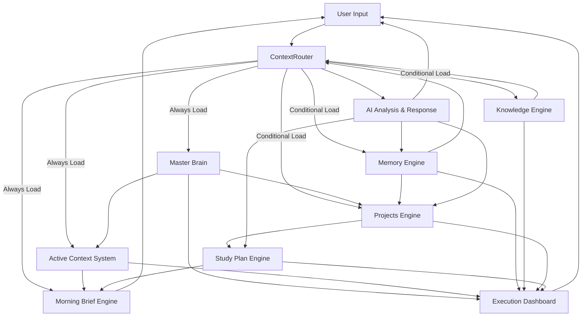

# AI Engines Architecture

This document outlines the architecture and relationships of the AI engines within the system, including a Mermaid diagram illustrating their communication flow.

## Master Brain Engine

The Master Brain engine (`src/lib/master-brain.ts`) serves as the control plane for the AI system. It manages the user's identity, mission, decision rules, and constraints. It stores and retrieves key information in a structured Markdown file (`data/00-core/MASTER-BRAIN.md`).

**Key functionalities:**
- **`getMasterBrainSections`**: Retrieves specific sections from the Master Brain document.
- **`getMasterBrainMarkdown`**: Fetches the entire Master Brain document as Markdown.
- **`getMasterBrainDocument`**: Parses and returns the Master Brain document as a structured object.
- **`saveMasterBrainDocument`**: Saves updates to the Master Brain document.
- **`getActiveContextFields`**: Extracts and provides active context fields, such as "Current Top Goal", "Current Relationship Status", etc., from the Master Brain.

## Active Context System

The Active Context system is a dynamic subset of the Master Brain that provides real-time, relevant contextual information to the AI. It is powered by the `getActiveContextFields` function within the Master Brain engine.

**Key aspects:**
- Provides immediate context for ongoing interactions.
- Includes fields like current goals, priorities, and focuses.
- Ensures AI responses are aligned with Rafa's current state.

## Memory Engine

The Memory engine (`src/lib/memories.ts`) is responsible for storing, retrieving, and suggesting memories based on user interactions. It uses a PostgreSQL database for persistent storage.

**Key functionalities:**
- **`listMemories`**: Retrieves a list of memories based on user ID, search terms, and categories.
- **`listMemoryCategories`**: Lists all distinct memory categories for a user.
- **`getMemoryForUser`**: Fetches a specific memory by ID for a given user.
- **`searchRelevantMemoriesForMessage`**: Searches for memories relevant to a user's message using keyword extraction and similarity scoring.
- **`suggestMemoryFromConversation`**: Analyzes user messages and assistant responses to suggest new memories or updates to existing ones.
- **`saveMemorySuggestion`**: Persists a new memory or merges a suggested memory with an existing one.

## Knowledge Engine

The Knowledge engine (`src/lib/knowledge.ts`) manages and provides access to a structured knowledge library. It loads knowledge from Markdown files and a `knowledge-index.json` file.

**Key functionalities:**
- **`loadKnowledgeIndex`**: Loads the main knowledge index.
- **`getKnowledgeLibrary`**: Retrieves the knowledge library, including files categorized by tags.
- **`getKnowledgeLibraryWithContent`**: Fetches the knowledge library with the full content of each knowledge file.
- **`getKnowledgeIndexSummary`**: Provides a summary of the knowledge index, including topics and files.
- **`selectKnowledgeForMessage`**: Selects and retrieves relevant knowledge files based on a user's message and associated tags.

## Projects Engine

The Projects engine (`src/lib/projects.ts`) manages user projects, tasks, and their progress. It interacts with the database to store project-related information.

**Key functionalities:**
- **`listProjectsWithStats`**: Lists projects along with statistics such as completed tasks, knowledge count, and memory count.
- **`getProjectForUser`**: Retrieves a specific project for a user.
- **`createProject`**: Creates a new project.
- **`updateProject`**: Updates an existing project.
- **`archiveProject`**: Changes a project's status to "Archived".
- **`deleteProject`**: Deletes a project and all associated tasks, memories, and knowledge links.

## Study Plan Engine

The Study Plan engine (`src/lib/study-plan.ts`) focuses on tracking and managing Rafa's study progress, particularly for the GIS roadmap.

**Key functionalities:**
- **`getStudyPlanSummary`**: Provides an overview of the study plan, including tasks, completion percentage, current week, and phase.
- **`updateStudyTaskStatus`**: Updates the status of a specific study task.
- **`readRoadmapStartDate`**: Reads the start date of the GIS roadmap.
- **`readRoadmapTasks`**: Reads and parses the individual tasks from the roadmap Markdown files.

## Execution Dashboard

The Execution Dashboard engine (`src/lib/execution-dashboard.ts`) aggregates data from various engines to provide a comprehensive overview of Rafa's progress, priorities, and current status.

**Key functionalities:**
- **`getExecutionDashboardData`**: Gathers and processes data to present the full dashboard view, including active focus, project progress, streaks, and mission completion.
- **`updatePriorityCompletion`**: Marks a priority as completed.
- **`updateExecutionTaskStatus`**: Updates the status of an execution task, and subsequently updates project progress.

## Context Router

The Context Router engine (`src/lib/context-router.ts`) acts as a central dispatcher for determining which contextual information is relevant to a user's message and then loading it. This is critical for optimizing AI responses by providing only the necessary data.

**Key functionalities:**
- **`buildRoutedPrompt`**: Analyzes the user's message and constructs a prompt by routing and loading relevant context from other engines.
- **`routeContext`**: Determines which context keys (e.g., Master Brain, Memory, Knowledge) should be loaded based on keywords in the user's message.
- **`loadContext`**: Dynamically loads content for a given context key by calling functions from other engines (e.g., `getMasterBrainMarkdown`, `searchRelevantMemoriesForMessage`, `selectKnowledgeForMessage`).

## Morning Brief

The Morning Brief engine (`src/lib/morning-brief.ts`) generates a concise daily briefing for Rafa, summarizing his current status, objectives, and key reminders.

**Key functionalities:**
- **`generateMorningBrief`**: Creates a personalized morning brief using information from the Active Context and Study Plan engines.

## Relationships Between All Engines

The AI engines are interconnected to provide a cohesive and intelligent system:

- **Master Brain** is foundational, providing identity, mission, and rules to all other engines, directly influencing behavior and context.
- **Active Context** is a dynamic subset of Master Brain, offering real-time situational awareness, primarily consumed by the Context Router and Morning Brief.
- **Memory Engine** stores and retrieves past interactions and durable preferences, informing the Context Router and potentially influencing project and study plan adjustments.
- **Knowledge Engine** provides structured, searchable domain knowledge, which the Context Router selectively loads based on user queries.
- **Projects Engine** manages concrete tasks and project progress. Its data can be surfaced in the Execution Dashboard and influences the Active Context.
- **Study Plan Engine** tracks educational roadmap progress, feeding into the Execution Dashboard and Morning Brief to guide daily activities.
- **Execution Dashboard** acts as an aggregator, pulling data from Projects, Study Plan, and Master Brain to present a holistic view of Rafa's progress.
- **Context Router** is the central orchestrator for information retrieval, dynamically deciding which engines to query (Master Brain, Memory, Knowledge, Projects) to build the most relevant prompt for the AI.
- **Morning Brief** synthesizes information from Active Context and Study Plan to prepare Rafa for his day.

## End-to-end AI Execution Flow

1.  **User Input**: Rafa provides a message or query.
2.  **Context Routing**: The Context Router analyzes the message and decides which engines are relevant:
    *   It **always** loads the Master Brain, Active Context, and Morning Brief for core identity, current state, and daily guidance.
    *   It **conditionally** loads content from Memory (for past preferences/history), Knowledge (for domain-specific information), or Projects (for task/project status) based on keywords in the user's message.
3.  **Context Loading**: The Context Router calls the appropriate functions in other engines (e.g., `getMasterBrainMarkdown`, `searchRelevantMemoriesForMessage`, `selectKnowledgeForMessage`) to gather the necessary data.
4.  **Prompt Construction**: The Context Router compiles all the loaded context into a comprehensive AI prompt, along with the user's original message and system instructions.
5.  **AI Analysis and Response**: The AI system processes the routed prompt, analyzes the information, identifies potential conflicts with long-term goals or decision rules, and then generates a response, a recommendation, and concrete next actions according to its response rules. The AI may also suggest new memories based on the conversation.
6.  **Memory Suggestion/Update**: If a memory is suggested, the Memory engine (`suggestMemoryFromConversation` and `saveMemorySuggestion`) processes and stores it, potentially merging with existing memories.
7.  **Dashboard/Study Plan Updates**: User actions or AI-driven decisions might trigger updates in the Projects engine (e.g., task completion) or Study Plan engine (e.g., task status), which are then reflected in the Execution Dashboard.

## Mermaid Diagram: AI Engine Communication Flow

